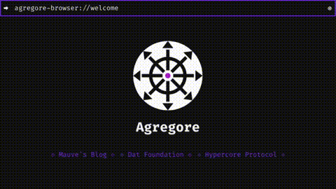

# Agregore Browser
A minimal web browser for the distributed web

	

[Website](https://agregore.mauve.moe/)

[Download the installer](https://github.com/AgregoreWeb/agregore-browser/releases)

[Matrix Chat](https://matrix.to/#/#agregore:mauve.moe)

[Discord Chat](https://discord.gg/QMthd4Y)

## Videos

[Overview from SpeakeasyJS](https://www.youtube.com/watch?v=ciRWmEhL8e8)

[Watch the intro video from Dat Conference](https://www.youtube.com/watch?v=TnYKvOQB0ts&list=PL7sG5SCUNyeYx8wnfMOUpsh7rM_g0w_cu&index=14)  

[Intro to IPFS interface from IPFS meetup](https://youtu.be/kI9Issf3MNc?t=1606)

[5 minute overview from Dweb meetup](https://archive.org/embed/dweb-meetup-dec-2020-dweb-lightning-talks?start=4212)

[Decentralized Web - Bloom Fireside](https://www.youtube.com/watch?v=gHrul4jEHvs)

## Goals

- Enable people to make and use local first apps using the web
- Be minimal (fewer built-in features, leave more to the OS)
- Be open to anything p2p / decentralized / local-first
- Rely on web extensions for extra functionality
- Work with mesh networks / Bluetooth Low Energy networks

## Features

### Keyboard Shortcuts
(Ctrl means Command or Control)
|Shortcut|Does|Is configurable|
|:-:|:-:|:-:|
|Alt|Show Menu Bar|-|
|Ctrl+N|New Window|+|
|F11|Fullscreen|-|
|Ctrl+M|Minimize|-|
|Ctrl+W|Close|-|
|Ctrl+Shift+I|Open Devtools|+|
|Ctrl+]|Navigate Forward|+|
|Ctrl+\[|Navigate Backward|+|
|Ctrl+L|Focus URL Bar|+|
|Ctrl+F|Find in page|-|
|Ctrl+R|Reload|+|
|Ctrl+Shift+R|Hard Reload|+|
||Learn More|+|
||Open Extensions Folder|+|
|Ctrl+.|Edit Config File|+|

### Other features

- Web Extension support
- Built-in Markdown/Gemini/JSON rendering extension
- Built-in QR code scanner and generator extension
	- Generate a QR code for the current page
	- Scan a QR code from the browser action window.
	- Right click a link or image to generate a QR code for it
- Built-in ad blocker (ublock origin)
- Built-in support for creating web archives via [ArchiveWeb.page](https://github.com/webrecorder/archiveweb.page/)
- Open links in new windows (right click on element)
- Find text on the page (`ctrl+f` to bring into focus, `esc` to hide)
- Autocomplete URLs from history (type in the URL bar, up/down to navigate, right to autocomplete)
- Persist open windows when quitting
- Save files from pages (any protocol, right click it)
- Set as default browser (click Set As Default in the menu bar (`ALT`))
- Set as default Torrent handler (click Set as Default Torrent in the menu bar (`ALT`))
- Auto-convert SSB sigils, BitTorrent magnet links, `/ipfs/Qm` paths, and `/ipns/` paths to proper URLs.
- Configure whether the menu bar should be visible by default (edit .agregorerc `autoHideMenuBar` property)

## Docs

Check out the [documentation](./docs).

## Contributing

Feel free to open a Github issue if you wish to tackle one of the items on the roadmap, or message @RangerMauve directly on whatever platform you can find them on.

This project uses the [StandardJS](https://standardjs.com/) code style. Please format your code with `standard --fix` or run `npm run lint`.

To build from source do the following:

- Set up node.js (at least Node 18), git, and yarn
- Set up [Node-gyp](https://github.com/nodejs/node-gyp) and its dependencies for your OS
- fork the repo
- Pull your fork to your computer
- Load submodules with `git submodule update --init --recursive`
- Run `yarn` or `npm install` to install dependencies
- Run `yarn start` or `npm start` to start the browser and test your changes
- After coding, when ready to submit, run `npm run lint` or `yarn lint` to check code style
- Push to your clone
- Submit a pull request

Other notes:
- To debug extensions, run `yarn debug` to have devtools opened for their background pages
- If you're interested in a CLI for these protocols, check out [curld](https://github.com/Lohn/curld) `cURL for Distributed Web`. That project supports the same protocols as Agregore, but in a terminal way.
- To download the latest versions of ArchiveWeb.page or Ublock Origin, run `yarn download-extennsions`
